# PrintBit Architecture

## Overview

PrintBit is a self-service kiosk system running on Windows, structured as two collaborating processes:

1. **Node.js Core Application (`src/`)**: Express web server and Socket.IO coordinator hosting customer touchscreens, mobile upload portals, document analysis, pricing engine, financial ledger, and administrative APIs.
2. **C# .NET 10 Windows Service Worker (`worker/`, `PrintBitHardware`)**: Background system daemon running as `LocalSystem` that controls physical hardware (printer spooler, coin acceptor, hopper), Windows platform services (power monitoring, Defender scans, USB drives, NTP time, scanning), and document format conversion.

Both processes communicate via local filesystem handoff (file queues) and Windows Named Pipes.

---

## System Architecture Diagram

```mermaid
flowchart TB
    subgraph Clients["Clients"]
        KioskUI["Kiosk Touchscreen UI (Browser)"]
        MobileClient["Customer Mobile Device (Upload Portal)"]
        AdminUI["Admin Dashboard"]
    end

    subgraph NodeApp["Node.js Application (Express + Socket.IO)"]
        Server["HTTP / Socket.IO Server (src/server.ts)"]
        Routes["API & Portal Routes (src/routes/)"]
        DocAnalysis["Document Analysis & Coverage (src/services/document-analysis.ts)"]
        PricingEngine["Pricing Engine & Quotes (src/services/pricing-engine.ts)"]
        Ledger["Financial Ledger & Settlement (src/services/settlement.ts)"]
        Projections["Hardware & Spooler State Projections (src/services/)"]
        SQLite[(SQLite Database: printbit.sqlite)]
    end

    subgraph IPC["Inter-Process Communication Boundary"]
        QueueDir["Queue Directory (worker/queue/)<br/>Atomic .pdf + .json sidecar"]
        CommandPipe["Pipe: printbit-worker-commands<br/>(Request/Response JSON RPC)"]
        EventPipe["Pipe: printbit-worker-events<br/>(Telemetry & State Stream)"]
        ErrorPipe["Pipe: printbit-node-errors<br/>(Error Logging Stream)"]
        ConvPipe["Pipe: printbit-document-conversion<br/>(Office to PDF)"]
    end

    subgraph DotNetWorker["C# .NET 10 Worker Service (PrintBitHardware)"]
        HostService["Host & Command Dispatcher (PrintBit.HardwareService)"]
        QueueWatcher["PrintQueueWatcher & Job Orchestrator"]
        SpoolerControl["Printer Health Monitor & Spooler Recovery (WinSpool)"]
        PlatformSvc["Windows Platform Services (Power, Defender, USB, Time, Scan)"]
        HwOrchestrator["Hardware Orchestrator & Serial Host"]
        DocConverter["LibreOffice Conversion Service"]
    end

    subgraph Peripherals["Physical Hardware & Windows OS"]
        EpsonPrinter["Epson L5290 Printer (Standard & High Spooler Queues)"]
        ArduinoESP["Arduino / ESP32 Controller (115200 Baud Serial)"]
        CoinSlot["Coin Acceptor (Pulse Input)"]
        Hopper["Coin Hopper (1-Peso Dispenser)"]
        ScannerHw["Document Scanner (NAPS2 / WIA / TWAIN)"]
        UsbDisks["USB Flash Storage"]
        WinOS["Windows OS (Power APIs, Windows Defender, System Spooler)"]
    end

    %% Client connections
    KioskUI <-->|HTTP / Socket.IO| Server
    MobileClient <-->|HTTP Upload Portal| Server
    AdminUI <-->|HTTP REST| Server

    %% Node internal
    Server --> Routes
    Routes --> DocAnalysis
    Routes --> PricingEngine
    Routes --> Ledger
    Routes --> SQLite
    Projections <-->|Broadcast Events| Server

    %% Node to IPC
    Routes -->|Handoff PDF + Sidecar| QueueDir
    Routes & Projections <-->|Commands & Responses| CommandPipe
    EventPipe -->|Stream Events| Projections
    Server -->|Forward Errors| ErrorPipe
    DocAnalysis <-->|Convert Files| ConvPipe

    %% IPC to Worker
    QueueDir -->|Watch & Consume| QueueWatcher
    CommandPipe <--> HostService
    HostService --> PlatformSvc
    HostService --> SpoolerControl
    HostService --> HwOrchestrator
    ErrorPipe --> HostService
    ConvPipe <--> DocConverter

    %% Worker to Peripherals
    QueueWatcher -->|SumatraPDF CLI| EpsonPrinter
    SpoolerControl <-->|Win32 Spooler API| EpsonPrinter
    HwOrchestrator <-->|Serial COM| ArduinoESP
    ArduinoESP --> CoinSlot
    ArduinoESP --> Hopper
    PlatformSvc <--> ScannerHw
    PlatformSvc <--> UsbDisks
    PlatformSvc <--> WinOS
    HwOrchestrator -.->|Publish Telemetry| EventPipe
    SpoolerControl -.->|Publish Telemetry| EventPipe
    PlatformSvc -.->|Publish Telemetry| EventPipe
```

---

## Runtime Layers

### 1) Node.js Kiosk Application (`src/`)

#### A. HTTP + Realtime Layer (`src/server.ts`)

- Express 5 HTTP server hosting APIs, upload portal, and admin views.
- Socket.IO server emitting realtime balance updates, coin insertion events, upload progress, hopper dispensing status, power safety alerts, and printer state projections.

#### B. Route Layer (`src/routes/`)

- `financial-routes.ts`: balance inquiry, pricing estimates, payment confirmation, legacy print triggers.
- `wireless-session-routes.ts`: mobile upload session creation, tokenized QR endpoints, document previews.
- `upload-portal-routes.ts`: tokenized mobile web portal and client assets.
- `copy-routes.ts`: copy job submission, preview generation, and status polling.
- `scan-routes.ts`: scan acquisition, preview retrieval, and USB export lifecycles.
- `admin-routes.ts`: dashboard metrics, transaction contexts, hardware manual actions, and settings.
- `page-routes.ts`: kiosk touch interface HTML pages.

#### C. Service & Domain Layer (`src/services/`)

- `printer.ts` & `worker-handoff.ts`: validates print requests and atomically writes target PDFs and `.json` sidecars to the worker queue.
- `document-analysis.ts`: analyzes PDF and image coverage/color pixel distributions to classify pages (`blank`, `bw`, `partial`, `full_color`).
- `pricing-engine.ts` & `print-quote.ts`: localized whole-peso pricing rules, threshold classifications, proportional partial pricing, and bulk tier discounts.
- `settlement.ts`: payment settlement coordinator; calculates debit against inserted balance, updates financial ledger, and triggers coin change payout.
- `session.ts`: in-memory wireless upload session state with idle timeouts and single-device locking.
- `worker-command-pipe.ts` & `platform-worker-client.ts`: duplex IPC client for sending structured JSON commands to the .NET worker.
- `worker-return-pipe.ts`: streaming IPC client consuming worker events and feeding in-memory state projections.
- `printer-state-projection.ts`, `hardware-state-projection.ts`, `power-safety.ts`: cached reactive projections reflecting worker hardware states into Express and Socket.IO.
- `modules/receipt`: tokenized digital receipt generation, validation, and 24-hour retention lifecycle.

#### D. Database Layer (`src/core/database/`)

- `db.ts` & `sqlite-storage.ts`: SQLite database (`printbit.sqlite`) managing system settings, financial earnings, coin/job metrics, audit logs, file analysis hash caches, owed-change ledgers, and receipt tokens.

#### E. Frontend Layer (`src/public/`)

- Client-side static single-page modules for print setup, upload staging, document preview, copy, scan, payment prompt, and admin management.

---

### 2) .NET 10 Windows Service Worker (`worker/`)

The worker is implemented in C# (.NET 10) and hosted as a Windows Service (`PrintBitHardware`). It enforces single-instance execution via a machine-wide mutex (`Global\PrintBitHardwareWorker`).

#### A. Host Project (`PrintBit.HardwareService`)

- Entry point (`Program.cs`) configuring dependency injection, logging (Serilog to file), Windows Service lifetime, and hosted background services:
  - `PrintQueueWatcher`: watches queue directory for print job sidecars and documents.
  - `WorkerCommandPipeHostedService`: multi-client asynchronous named pipe server for `printbit-worker-commands`.
  - `ErrorPipeHostedService`: named pipe server receiving and logging Node.js error entries.
  - `DocumentConversionPipeHostedService`: named pipe server executing LibreOffice format conversions.
  - `PrinterHealthMonitor`: continuous WinSpool polling and health evaluation.
  - `PowerMonitorService`: Win32 battery/AC power polling.
  - `UsbDriveMonitor`: removable storage discovery and scan file export.
  - `SerialHostedService`: serial connection lifecycle management.

#### B. Application Layer (`PrintBit.Application`)

- `HardwareOrchestrator`: routes incoming hardware events and commands.
- `TransactionStateMachine`: manages transactional state transitions across hardware steps.
- `HardwareEventQueue`: bounded `Channel<Esp32Message>` decoupling serial ingestion from event handling.

#### C. Hardware Abstraction Layer (`PrintBit.Hardware`)

- `Devices/CoinAcceptor`: pulse-to-value decoding (`CoinPulseDecoder`) and coin slot control (`ICoinAcceptor`).
- `Devices/Hopper`: Arduino/ESP32 hopper protocol parser (`HopperProtocolParser`) and payout command dispatcher (`HopperDevice`).
- `Devices/ESP32`: serial framing, telemetry parsing (`Esp32TelemetryParser`), and command construction.

#### D. Infrastructure Layer (`PrintBit.Infrastructure`)

- `Services/PrintService`:
  - `DocumentPrinter`: executes jobs via SumatraPDF CLI (`-print-to "<queue>" -print-settings "<copies>" "<path>"`).
  - `JobOrchestrator`: serializes print execution using `SemaphoreSlim(1,1)` and manages per-job timeouts.
  - `PrinterProfileResolver`: maps requested quality (`standard` vs `high`) to dedicated Windows logical queues (`EPSON L5290 Series` vs `PrintBit - High`).
  - `WinSpoolApi`: P/Invoke Win32 spooler API wrappers for queue status, pause/resume, and job cancellation.
- `Services/DocumentConversion`:
  - `LibreOfficeDocumentConversionService`: headless LibreOffice executor converting DOCX/XLSX/PPTX to PDF.
  - `ImageToPdfConverter`: converts standard image formats into printable PDFs.
- `Services/DocumentProcessing`:
  - `DocumentPreprocessor`: page range slicing, custom page selection filtering, and rotation transforms.

#### E. Windows Platform Infrastructure (`PrintBit.Infrastructure.Windows`)

- `PowerMonitoring`: Win32 `GetSystemPowerStatus` abstraction (`NativePowerStatusProvider`) and `PowerSafetyGate` blocking print jobs on low battery or AC failure.
- `PrinterMonitoring`: `PrinterRecoveryService` and `ServiceControllerSpoolerController` for automatic print spooler service restarts and job flush routines.
- `Scanning`: `Naps2ScannerService` running NAPS2 CLI to acquire scans via WIA/TWAIN devices.
- `Security`: `WindowsDefenderScanner` executing `MpCmdRun.exe` signature scans against uploaded user documents before processing.
- `Storage`: `UsbDriveMonitor` managing removable drive enumeration and secure file export.
- `Time`: `WindowsTrustedTimeProvider` evaluating NTP synchronization and clock drift to guard financial transaction timestamps.
- `Networking`: `WindowsKioskNetworkPlatform` managing network adapter states and captive hotspot bindings.

#### F. Shared Layer (`PrintBit.Shared`)

- Strongly typed contracts, DTOs, Enums (`TransactionState`, `PrinterState`, `HardwareState`), and configuration models (`HardwareSettings`, `IpcSettings`, `PowerSettings`, `PrinterRecoverySettings`).

---

## Inter-Process Communication (IPC)

| Channel                      | Transport                                  | Direction     | Purpose                                                                                                | Format                               |
| ---------------------------- | ------------------------------------------ | ------------- | ------------------------------------------------------------------------------------------------------ | ------------------------------------ |
| **Print Queue**              | Filesystem (`worker/queue/`)               | Node → Worker | Atomic print job submission (`.pdf` + `.json` sidecar)                                                 | PDF binary + JSON metadata           |
| **Worker Command Pipe**      | Named Pipe: `printbit-worker-commands`     | Node ↔ Worker | Synchronous command/query RPC (spooler recovery, job cancel, coin dispense, scan, Defender, USB, time) | JSON line-delimited (Max 8192 bytes) |
| **Worker Event Pipe**        | Named Pipe: `printbit-worker-events`       | Worker → Node | Asynchronous event stream (print progress, spooler status, coin events, hopper dispense, power state)  | JSON line-delimited stream           |
| **Node Error Pipe**          | Named Pipe: `printbit-node-errors`         | Node → Worker | Forwarding unhandled Node errors to worker Serilog logs                                                | JSON line-delimited stream           |
| **Document Conversion Pipe** | Named Pipe: `printbit-document-conversion` | Node ↔ Worker | Headless document-to-PDF conversion via LibreOffice                                                    | JSON line-delimited RPC              |

### IPC Security & Synchronization

- **Machine Mutex**: Worker acquires `Global\PrintBitHardwareWorker` at startup. If another instance is running, it logs a critical error and immediately exits with code 2.
- **Pipe Access Control**: Under LocalSystem, pipe ACLs restrict access to SYSTEM and the configured kiosk user identity (`Ipc__WorkerCommandAllowedClientIdentity`).

---

## Data Model & State Storage

### Persistent Storage (`printbit.sqlite`)

- `balance`: current cash inserted into coin acceptor.
- `earnings`: historical operational revenue.
- `settings`: pricing parameters, engine classification thresholds, timeout configurations, and admin PIN hashes.
- `coinStats` & `jobStats`: lifetime coin counter metrics and operational print/copy/scan volumes.
- `logs`: audit log trail for admin actions, hardware alerts, and financial settlements.
- `analysisCache`: file hash to document analysis classification map (avoids re-scanning duplicate documents).
- `owedChanges`: unresolved hopper change deficit ledger for admin settlement.
- `receipts` & `receiptAccessTokens`: e-receipt snapshots with 24-hour retention.

### Ephemeral State

- **Node Memory**: upload sessions (`session.ts`), copy/scan state machines (`job-store.ts`), hardware and printer state projections (`*-state-projection.ts`).
- **Worker Memory**: hardware event queue (`Channel<Esp32Message>`), spooler job trackers, active print lock (`SemaphoreSlim`), command handler concurrency slots.

---

## Main Operational Flows

### A) Wireless Print Flow

1. **Session Creation**: Kiosk UI requests a wireless upload session; backend returns session ID and tokenized QR URL.
2. **Mobile Upload**: User scans QR on smartphone, loads portal, and uploads file. Single-device lock (`x-upload-client-id`) and idle TTL prevent collisions.
3. **Security Gate**: Worker scans uploaded file using Windows Defender (`ScanFileSecurity` via command pipe). Infected files are quarantined and rejected.
4. **Document Preprocessing**: Non-PDF formats are converted to PDF via LibreOffice conversion pipe.
5. **Coverage & Analysis**: Node document analysis service calculates page color ratios, classifying each page (`blank`, `bw`, `partial`, `full_color`).
6. **Quote & Pricing**: Quote endpoint returns pricing engine breakdown based on detected color distributions, paper size, and bulk tiers.
7. **User Configuration**: User adjusts copies, page ranges/selection, and print quality (`Standard` vs `High`) on kiosk touchscreen.
8. **Payment & Settlement**: User inserts coins. Balance updates in realtime via serial pulse decoder. User confirms payment: balance is deducted, earnings recorded, and change dispensed.
9. **Worker Queue Handoff**: Node writes target PDF and sidecar `.json` containing exact print configuration into `worker/queue/`.
10. **Print Execution**: Worker's `PrintQueueWatcher` detects JSON sidecar, selects matching logical queue (`EPSON L5290 Series` for Standard, `PrintBit - High` for High), and invokes SumatraPDF.
11. **Telemetry & Feedback**: Worker streams progress events over `printbit-worker-events`; Node projects events to Socket.IO and updates kiosk UI.

### B) Document Analysis & Pricing Classification

1. **Images**: Pixel sampling counts color vs grayscale pixels to determine color ratio (0.0 to 1.0).
2. **PDFs**: Operator-based stream scanning detects color space and paint operators per page.
3. **Classification**:
   - `blank` (coverage < 0.05): applies configured `blankPagePolicy` (`charge_zero`, `charge_bw`, `charge_color`).
   - `bw` (coverage ≤ `bwMax` threshold): charges standard B&W rate.
   - `partial` (coverage between thresholds): charges proportional pricing between base B&W and full color.
   - `full_color` (coverage ≥ `fullColorMin` threshold): charges full color rate.
4. **Pricing Engine**: Applies bulk discounts, enforces whole-peso rounding, and caches results by file hash.

### C) Copy Flow

1. Kiosk scanner acquires document preview via worker command pipe (`StartScan`).
2. User selects copy settings (copies, color mode, page range).
3. Copy job validates preview file, checks funds, and queues print job through worker queue handoff.
4. Settlement zero-outs balance and dispenses change.

### D) Scan Flow (Kiosk & USB Export)

1. Worker triggers flatbed/ADF scan via NAPS2 CLI integration.
2. Scanned image/PDF is returned to Node staging.
3. Customer selects delivery destination:
   - Mobile transfer via wireless session QR code.
   - USB flash drive export: worker enumerates removable drives (`ListUsbDrives`) and writes the file (`ExportScanToUsb`).

### E) Coin Acceptance & Change Dispensing

1. **Coin Ingestion**: Microcontroller sends pulse events over serial line. Worker decodes pulses to 1, 5, 10, or 20 peso values and notifies Node over the event pipe.
2. **Payout**: During settlement, Node requests change payout via `DispenseCoins` command pipe call.
3. **Hopper Protocol**: Worker transmits `HOPPER DISPENSE <count>` to Arduino/ESP32. Payout uses whole 1-peso coins.
4. **Deficit Handling**: If hopper runs empty or jams, worker reports actual dispensed count. Remaining unpaid balance is recorded as an `owedChange` record in SQLite for admin refunding.

### F) Power Safety & Spooler Health Monitoring

1. Worker polls Windows battery and AC power status. If AC is lost and battery drops below threshold, `PowerSafetyGate` engages, worker emits `PowerStatusChanged`, and Node disables new paid jobs.
2. Worker monitors Windows print spooler via `WinSpoolApi`. If jobs get stuck in error/offline states, worker can automatically invoke spooler cleanup or execute an explicit `RestartPrintSpooler` command.

### G) E-Receipts & Admin Management

1. Upon successful settlement, Node creates an immutable receipt snapshot and generates a secure lookup token.
2. Customer scans on-screen QR code pointing to `/receipt/t/:token` to view or save digital receipt.
3. Admin dashboard exposes authenticated endpoints to review transaction logs, inspect owed changes, manage printer spooler recovery, test coin hopper dispensing, and adjust pricing.

---

## External Dependencies & Platform Requirements

- **Operating System**: Windows 10/11 64-bit (Professional or Enterprise recommended for Assigned Access / Kiosk Mode).
- **Physical Printer**: EPSON L5290 Series (or compatible multi-function printer) configured with two logical printer queues:
  - Default: `EPSON L5290 Series` (Printing Defaults configured for Standard quality).
  - High Quality: `PrintBit - High` (Printing Defaults configured for High quality).
- **Print Engine**: SumatraPDF CLI on system `PATH` or working directory.
- **Hardware Controller**: Arduino Uno or ESP32 connected via USB Serial (115200 baud).
- **Scanner Driver**: NAPS2 CLI installed and configured for WIA/TWAIN scanner hardware.
- **Office Conversion**: LibreOffice installed in standard program files location for headless PDF conversion.
- **Antivirus**: Windows Defender (`MpCmdRun.exe`) enabled for file quarantine validation.
- **Node.js**: v22.5.0 or higher.
- **.NET Runtime**: .NET 10 Runtime (or self-contained win-x64 build).
