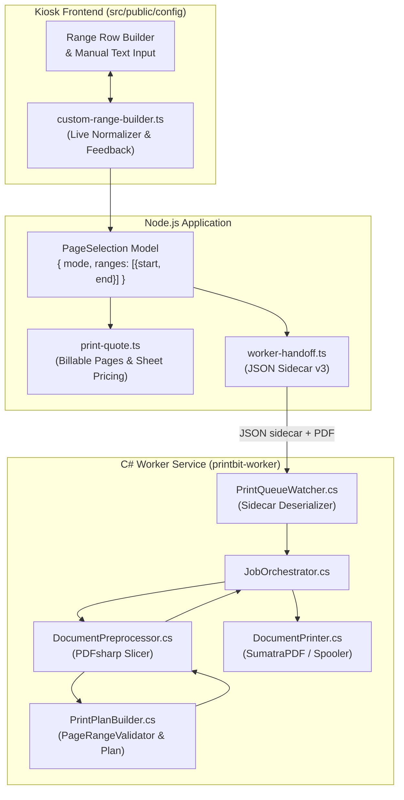

# Technical Design: Custom Range Enhancement & Optimization

## 1. Executive Summary

This design elevates custom page ranges from simple, brittle UI strings to a **first-class structured print-job domain model** across the entire PrintBit ecosystem — spanning the kiosk frontend (`src/public/config`), the Node.js backend pricing and queue orchestration, and the C# Worker Service (`printbit-worker`).

It delivers:

1. A touch-friendly, row-based range builder on the kiosk with live visual feedback, automatic adjacent/overlapping range merging, and an optional toggleable advanced manual text input.
2. Canonical domain types (`PageRange`, `PageSelection`) and normalization logic in Node.js.
3. A dual-support JSON sidecar contract for smooth backward compatibility between Node.js and C#.
4. A dedicated `PrintPlanBuilder` in the C# Worker Service that validates boundaries against document geometry, extracts exact page sets, and supplies verified print plans for slicing and spooling.

---

## 2. Architecture & Data Flow



---

## 3. Data Contracts & Domain Models

### 3.1 Canonical TypeScript Contract (`src/shared/page-selection.ts`)

```typescript
export interface PageRange {
  start: number;
  end: number;
}

export type PageSelectionMode = 'all' | 'custom' | 'single';

export interface PageSelection {
  mode: PageSelectionMode;
  ranges: PageRange[];
}

export interface NormalizedPageSelectionResult {
  mode: PageSelectionMode;
  ranges: PageRange[];
  totalSelectedPages: number;
  canonicalString: string;
  hasOverlapsMerged: boolean;
  warnings?: string[];
}
```

### 3.2 Normalization & Merging Rules

- **Bounds Clamping**: For a document with $N$ pages, every endpoint is constrained to $[1, N]$.
- **Inversion Recovery**: If $\text{start} > \text{end}$, values are swapped to ensure $\text{start} \le \text{end}$.
- **Sorting**: Ranges are sorted by $\text{start}$ ascending.
- **Merging**: For range $R_i$ and previous range $R_{prev}$:
  - If $R_i.\text{start} \le R_{prev}.\text{end} + 1$, merge into $R_{prev}$ where $R_{prev}.\text{end} = \max(R_{prev}.\text{end}, R_i.\text{end})$.
  - Otherwise, append as a distinct range.
- **Empty / Zero Handling**: If no valid ranges exist, falls back to `{ mode: 'all', ranges: [{ start: 1, end: N }] }` or marks invalid.

### 3.3 Handoff Sidecar Contract (`src/services/worker-handoff.ts`)

```json
{
  "copies": 1,
  "color": false,
  "pageRange": "1-5,7-9,15,22-25",
  "pageSelection": {
    "mode": "custom",
    "ranges": [
      { "start": 1, "end": 5 },
      { "start": 7, "end": 9 },
      { "start": 15, "end": 15 },
      { "start": 22, "end": 25 }
    ]
  },
  "duplex": false,
  "orientation": "portrait",
  "rotationDeg": 0,
  "paperSize": "A4",
  "quality": "standard",
  "scaling": "fit",
  "schemaVersion": 3,
  "transactionId": "...",
  "spoolerCorrelationKey": "..."
}
```

### 3.4 C# DTOs (`PrintBit.Shared` / `PrintBit.Infrastructure`)

```csharp
namespace PrintBit.Shared.Models;

public sealed record PageRangeDto(
    [property: JsonPropertyName("start")] int Start,
    [property: JsonPropertyName("end")] int End
);

public sealed record PageSelectionDto(
    [property: JsonPropertyName("mode")] string Mode,
    [property: JsonPropertyName("ranges")] IReadOnlyList<PageRangeDto> Ranges
);
```

---

## 4. Kiosk Frontend Design (`src/public/config`)

### 4.1 Component Modularization

Create `src/public/config/custom-range-builder.ts` to manage:

- Managing an array of visual rows `{ id: string, start: number, end: number }`.
- Emitting change events with `NormalizedPageSelectionResult`.
- Live feedback banner DOM management:
  - Count of selected pages vs. total pages (e.g., `8 of 30 pages`).
  - Estimated sheets count considering duplex mode.
  - Notice when overlapping ranges are merged (e.g., `Ranges 1–5 and 4–9 merged into 1–9`).
- Two-way sync with advanced manual input field (`<input id="customRangeManualInput" />`).
- Updating document preview page position on row focus or increment/decrement.

### 4.2 Markup Updates in `index.html`

- Replace static single `From - To` stepper with a container `#customRangeRowsContainer`.
- Add `+ Add page range` button (`#addCustomRangeRowBtn`).
- Add `<details>` accordion containing `#customRangeManualInput`.
- Preserve `#pageModeSingle` for fast 1-click single-page presets.

### 4.3 Styles in `styles.css`

- Add responsive row layout for touchscreen tap targets (min 44px height).
- Add styling for row delete icon button (`.custom-range-row__delete`).
- Add styling for live summary feedback card.

---

## 5. C# Worker Service Pipeline (`printbit-worker`)

### 5.1 `PrintPlanBuilder`

Create `PrintBit.Infrastructure.Services.PrintService.PrintPlanBuilder`:

- Receives `int documentPageCount` and `PrintJobSettings settings`.
- Evaluates `settings.PageSelection`:
  - Validates all ranges are $\ge 1$ and $\le documentPageCount$.
  - Normalizes, sorts, and merges.
  - Expands to a strictly ordered `IReadOnlyList<int>` containing distinct page numbers.
- If `PageSelection` is null, falls back to parsing legacy `settings.PageRange` string.
- Returns `PrintPlan(IReadOnlyList<int> SelectedPages, int TotalSelectedPages, int Copies, string NormalizedRangeString)`.
- Throws `InvalidDataException` if empty or invalid page boundary encountered.

### 5.2 `DocumentPreprocessor` & `JobOrchestrator`

- `DocumentPreprocessor.PrepareAsync`:
  - Uses `PrintPlanBuilder.Build(form.PageCount, settings)`.
  - Slices exactly the pages in `PrintPlan.SelectedPages`.
  - Adds duplex blank page if odd page count and duplex enabled.
- `JobOrchestrator.ProcessJobAsync`:
  - Validates that `prepared.PageCount` matches expected plan page count.
  - Logs planned pages.

---

## 6. Error Handling & Edge Cases

| Scenario                                 | Handled By            | Expected Behavior                                                       |
| ---------------------------------------- | --------------------- | ----------------------------------------------------------------------- |
| User enters `start > end` (e.g. `8 - 4`) | UI & Normalizer       | Auto-swaps/flips values to `4 - 8`.                                     |
| Overlapping ranges (`1-5, 4-9`)          | Normalizer            | Merges into `1-9`; displays info badge.                                 |
| Page number exceeds document pages       | UI & Validator        | Clamps to `maxPages`; rejects if manually injected.                     |
| Incomplete row                           | UI                    | Defaults `end` to `start`.                                              |
| Worker receives out-of-range sidecar     | C# `PrintPlanBuilder` | Fails fast with `PrintFailureStage.Validation`; logs descriptive error. |
| Zero pages selected                      | UI & Backend          | Disables Continue button; API rejects quote with 400.                   |

---

## 7. Verification & Testing

1. **Automated Unit Tests**:
   - `tests/page-selection.test.ts`: Validate normalization, merging, bounds, single page, and empty handling.
   - `tests/print-quote.test.ts`: Verify multi-range quote calculations, sheet counts, and duplex pricing.
   - C# `PrintPlanBuilderTests.cs`: Test `PageSelectionDto` and string fallback parsing, sorting, bounds validation.
2. **End-to-End & Manual Testing**:
   - Open kiosk config UI with sample multi-page PDF (e.g., 30 pages).
   - Verify row additions, stepper increments, preview page jumping, row deletions.
   - Verify manual text sync.
   - Verify `/confirm` screen reflects selected pages accurately.
   - Verify C# worker processes the job and prints only requested pages.
